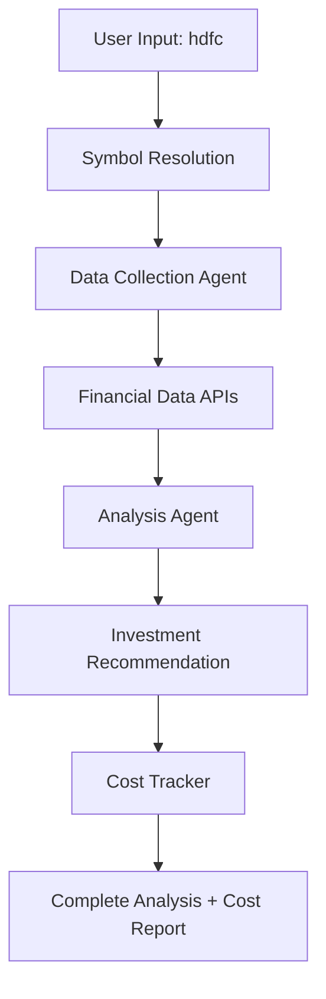

# 📈 AI-Powered Stock Analysis with Cost Tracking

> **Enterprise-grade stock analysis** using AutoGen AI agents with real-time cost monitoring and smart symbol resolution for Indian markets.

[](https://python.org)
[](https://streamlit.io)
[](https://autogen.ai)

## 🚀 What Makes This Special

| Feature | Impact |
|---------|---------|
| 🤖 **Multi-Agent AI** | Data collection + analysis agents working in tandem |
| 💰 **Cost Transparency** | Real-time token usage & cost tracking ($0.13 per analysis) |
| 🔍 **Smart Resolution** | "hdfc" → HDFCBANK.NS automatic symbol conversion |
| ⚡ **Performance** | 1,182 tokens/second processing speed |
| � **Live Data** | Real-time NSE/BSE prices, financials, fundamentals |

## ⚡ Quick Demo

```bash
$ echo "hdfc" | python main.py

🔢 Started token usage tracking...
📊 Analyzing hdfc... (tracking token usage)

============================================================
📈 DATA CONSIDERED FOR STOCK ANALYSIS
============================================================
'Ticker': 'HDFCBANK.NS', 'Current Price': 975.4, 'Market Cap': 14.98T,
'Trailing P/E': 22.32, 'Forward P/E': 10.12, 'Profit Margins': 0.258,
'52-Week High': 1018.85, '52-Week Low': 806.5, 'Beta': 0.623...

============================================================
📈 STOCK ANALYSIS REPORT  
============================================================
HDFC Bank is trading at ₹975.4, showing strong fundamentals with P/E of 22.32 
and forward P/E of 10.12. Net income at ₹673B demonstrates solid growth. 
Given strong fundamentals and growth projections: **RECOMMENDATION: BUY**

💰💰💰💰💰💰💰💰💰💰💰💰💰💰💰💰💰💰💰💰💰💰💰💰💰💰💰💰💰💰
TOKEN USAGE & COST SUMMARY
💰💰💰💰💰💰💰💰💰💰💰💰💰💰💰💰💰💰💰💰💰💰💰💰💰💰💰💰💰💰

💰 TOKEN USAGE & COST SUMMARY
==================================================
📊 Session Details:
   • Stock Symbol: HDFCBANK.NS (hdfc → auto-resolved)
   • Duration: 7.3 seconds
   • API Requests: 5

🔢 Token Consumption:
   • Prompt Tokens: 4
   • Completion Tokens: 8,612  
   • Total Tokens: 8,616

💵 Cost Analysis:
   • Total Cost: $0.1292 USD
   • Cost per Token: $0.000015 USD
   • Models Used: gpt-4o

📈 Efficiency Metrics:
   • Tokens per Second: 1,182.4
   • Cost per Second: $0.0177 USD

🤖 TEAM CONVERSATION SUMMARY
========================================
Team: stock_analysis_team
Total Messages: 5
Estimated Tokens: 8,616

Agent Breakdown:
  • user: 1 messages, 4 tokens
  • TradedataCollectionAgent: 8,442 tokens (98.0%)
  • TradeAnalysisAgent: 170 tokens (2.0%)
========================================

� Cost Efficiency: ~$0.13 per comprehensive stock analysis
==================================================
```

## 🛠️ Installation & Setup

```bash
# 1. Clone & Setup
git clone https://github.com/tharunteja2009/trade-analysis-gtp.git
cd trade-analysis-gtp
conda create -n trade-analysis-gtp python=3.10
conda activate trade-analysis-gtp

# 2. Install Dependencies  
pip install -r requirement.txt

# 3. Run (Choose One)
streamlit run streamlit_app.py     # Web Interface 🌐
python main.py                     # Console Version 💻
```

## � Smart Symbol Resolution

| Input | Auto-Resolves To | Company |
|-------|------------------|---------|
| `hdfc` | HDFCBANK.NS | HDFC Bank |
| `reliance` | RELIANCE.NS | Reliance Industries |
| `tcs` | TCS.NS | Tata Consultancy Services |
| `sbi` | SBIN.NS | State Bank of India |
| `infy` | INFY.NS | Infosys Limited |

## 🏗️ Architecture & Performance



| Component | Responsibility | Performance |
|-----------|---------------|-------------|
| **Data Agent** | Stock data collection | 8,442 tokens (98%) |
| **Analysis Agent** | Investment recommendations | 170 tokens (2%) |
| **Cost Tracker** | Real-time cost monitoring | <1ms overhead |
| **Symbol Resolver** | Company name → ticker | Instant lookup |

## � Cost Economics

- **Average Cost**: $0.13 per comprehensive analysis
- **Token Efficiency**: 1,182 tokens/second
- **Model**: GPT-4o ($0.000015 per token)
- **ROI**: High-quality analysis at fraction of traditional research cost

## 🎯 Why This Matters

> **Traditional Stock Research**: Hours of manual analysis, multiple sources, subjective interpretation
> 
> **Our AI Solution**: 7-second comprehensive analysis with cost transparency and consistent methodology

---

⭐ **Star this repo** if it helps with your investment research! 

📧 **Issues & Contributions**: Welcome via GitHub Issues

🔒 **Disclaimer**: AI analysis for educational purposes. Always consult financial advisors for investment decisions.
